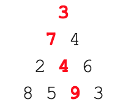

# Instructions

## The problem

By starting at the top of the triangle below and moving to adjacent numbers on the row below, the maximum total from top to bottom is 23.



That is, 3 + 7 + 4 + 9 = 23.

Our goal is to find the maximum total from top to bottom in the two triangles contained in the data folder:
 - [Triangle 1 (small - 15 rows)](./data/triangle_1.txt)
 - [Triangle 2 (big - 100 rows)](./data/triangle_2.txt)

## The solution

To solve this problem, write the body of the [computeMaxSum function](./computeMaxSum.js).

To test your function, run:

```sh
# in the root folder of this repository
npm test -- ./src/test_1
```

This will run the [compliance tests](./computeMaxSum.test.js)
